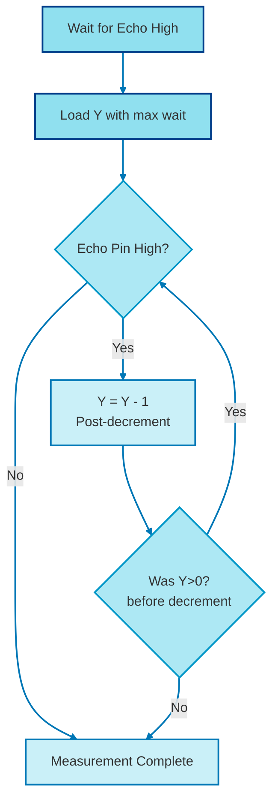

```mermaid
graph
    A[Wait for Echo High] --> B[Load Y with max wait]
    B --> C{Echo Pin High?}
    C -->|No| E[Measurement Complete]
    C -->|Yes| F[Y = Y - 1<br/>Post-decrement]
    F --> D{Was Y>0?<br/>before decrement}
    D -->|Yes| C
    D -->|No| E

    classDef start fill:#90e0ef,stroke:#023e8a,stroke-width:2px;
    classDef action fill:#caf0f8,stroke:#0077b6,stroke-width:2px;
    classDef decision fill:#ade8f4,stroke:#0096c7,stroke-width:2px;
    class A,B start;
    class F,E action;
    class C,D decision;
    
    linkStyle default stroke:#0077b6,stroke-width:2px;

    
    classDef note fill:#fff,stroke:#666,stroke-width:1px,stroke-dasharray: 5 5;
    class N1,N2,N3 note;
```
