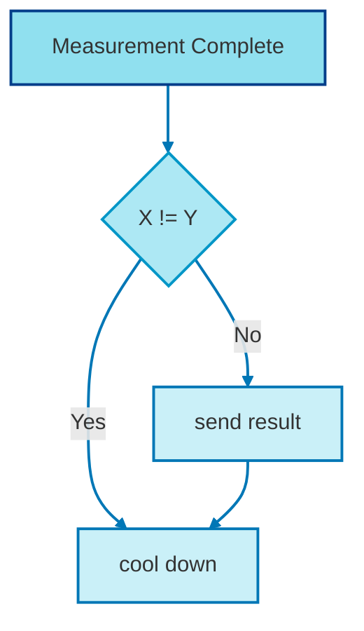

```mermaid
graph TB
    A[Measurement Complete] --> B{X != Y}
    B -->|No| D[send result]
    B -->|Yes| E
    D --> E[cool down]

    classDef start fill:#90e0ef,stroke:#023e8a,stroke-width:2px;
    classDef action fill:#caf0f8,stroke:#0077b6,stroke-width:2px;
    classDef decision fill:#ade8f4,stroke:#0096c7,stroke-width:2px;
    class A start;
    class D,E action;
    class B decision;
    
    linkStyle default stroke:#0077b6,stroke-width:2px;
```
